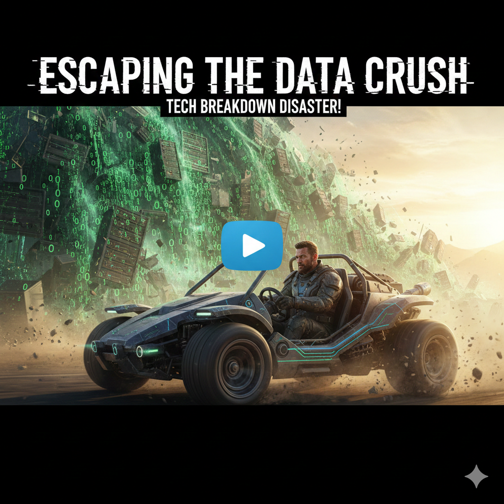
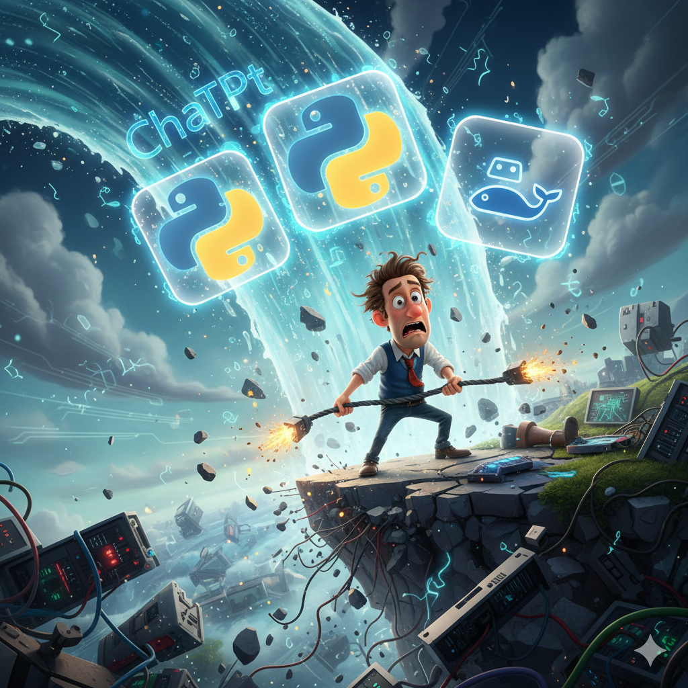
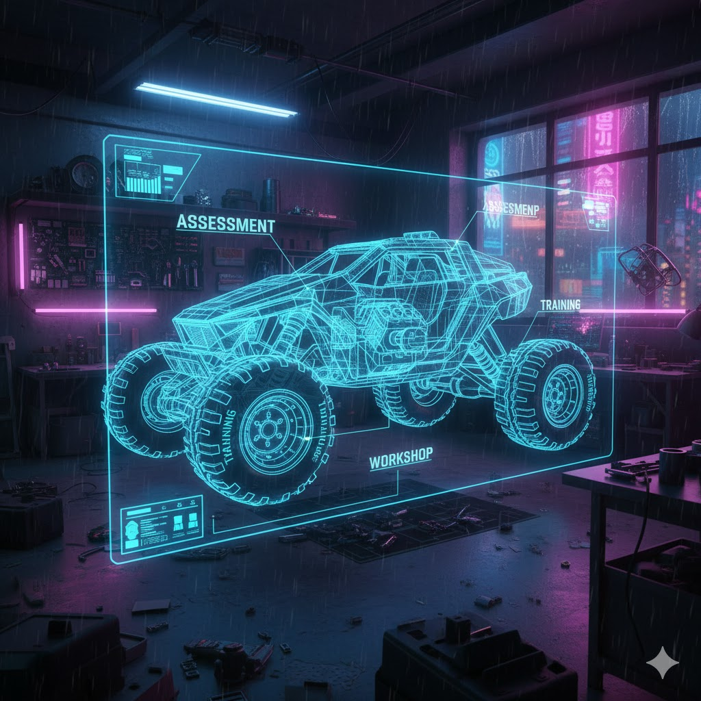
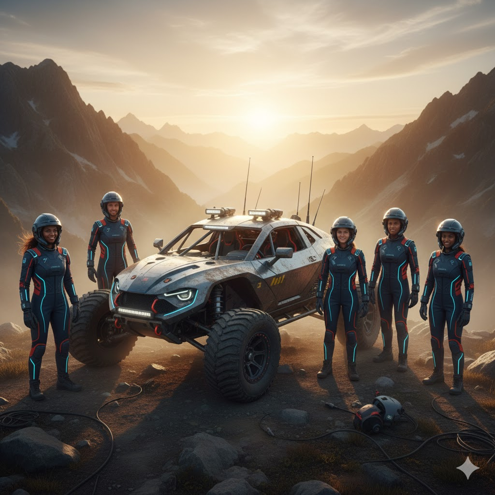

# 🎬 Video Script: The ATW Protocol (All-Terrain Workforce) 🚙💨

## 🚀 Viral Title & Thumbnail Ideas
**Title Options:**
1.  **"Why Senior Devs Are Getting Buried (And How to Survive)"** 📉
2.  **"I Shipped 200 Repos. Here's My Secret Weapon."** 🤫
3.  **"The AI Avalanche is Here. Get in the Vehicle."** 🌨️

**Thumbnail Concept:**
*   **Visual:** Rifat driving a futuristic, mud-splattered buggy (labeled "ATW") escaping a massive avalanche of binary code and "Old Tech" logos.
*   **Text Overlay:** "ESCAPE THE AI AVALANCHE" or "SURVIVE THE SHIFT".
*   **Expression:** Intense focus (not fear).
*   **🎨 Image Prompt:** `A cinematic YouTube thumbnail of a determined man driving a high-tech dune buggy away from a massive avalanche of green binary code and server racks, dynamic lighting, 4k, hyper-realistic.`

---

**Total A-Roll Time:** ~85 Seconds ⏱️
**Total B-Roll Time:** ~150 Seconds 🖥️
**Total Video Length:** ~4 Minutes 📼

---

# 🎭 ACT I: The Problem (The Avalanche) 🏔️
**🧠 MEMORY PALACE ANCHOR: THE AVALANCHE**

## 🟢 PROMPTER (A-ROLL) | 0:00 - 0:10 (10s)
*(Action: Holding tiny umbrella ☂️, looking scared)*

**"Feel that? That's the AI Avalanche. 🌨️ It's huge. It's fast. And if you're just standing there with your old resume, you're toast. You don't need an umbrella, folks. You need a ride."**

---

## 🎙️ PROMPTER (VOICEOVER) | 0:10 - 0:30 (20s)
*(Visuals: Fast montage: Graph shooting up 📈 -> Job description scrolling -> Confused stick figure)*

**"Companies don't want 'coders' anymore. They want Wizards. 🧙‍♂️ The ground is shaking. Your old map? Trash. We need a better way to move through this mess without getting buried."**

**🎨 Image Prompt (The Avalanche):** `A chaotic, stylized 3D animation of an office worker standing on a crumbling cliff edge, looking up at a massive wave of glowing AI icons (ChatGPT, Python, Docker) crashing down like an avalanche, Pixar style.`

---

# 🎭 ACT II: The Solution (The ATW Vehicle) 🚙
**🧠 MEMORY PALACE ANCHOR: THE GARAGE & BUGGY**

## 🟢 PROMPTER (A-ROLL) | 0:30 - 0:50 (20s)
*(Action: Slapping hood of futuristic buggy 🏎️)*

**"Meet the ATW. Assess. Train. Workshop. This is your All Terrain Vehicle. It eats chaos for breakfast. It turns your team from scared hikers into off-road beasts. Let's pop the hood."**

---

## 🎙️ PROMPTER (VOICEOVER) | 0:50 - 1:50 (60s)
*(Visuals: Assessment Engine Check 🔧, Report Diagnostic 📋, Training Upgrades ⚙️, Blueprint Image)*

**"First, the Engine Check. We scan everything—Security, Culture, CI/CD. No guessing games."**

**"The report tells us exactly what's smoking. 'Oil leak in Security?' Boom, we fix it."**

**"Then, Upgrades. We don't do boring lectures. We install new parts. MLSecOps tires. AIOps suspension. Shiny and chrome."**

**"This isn't random. It's engineering. The Assessment tells us what to Train. The Training gets the car ready to race."**

**🎨 Image Prompt (The Blueprint):** `A glowing blue holographic blueprint of a futuristic all-terrain vehicle, with parts labeled 'Assessment' (Engine), 'Training' (Tires), and 'Workshop' (Chassis), high-tech garage background, cyberpunk aesthetic.`

---

# 🎭 ACT III: The Outcome (X-Shaped Builders) ❌
**🧠 MEMORY PALACE ANCHOR: THE MOUNTAIN PEAK**

## 🟢 PROMPTER (A-ROLL) | 1:50 - 2:20 (30s)
*(Action: Driving wildly but confidently 🏎️)*

**"Now we drive. The Workshop. This is where we actually build stuff. We don't just talk theory; we ship code. I've shipped 200+ repos 📦 this way. We turn your people into X-Shaped drivers—they can handle ANY terrain. Mud, snow, AI apocalypse? No problem."**

---

## 🎙️ PROMPTER (VOICEOVER) | 2:20 - 3:30 (70s)
*(Visuals: **FAST SCROLL of Rifat's GitHub Profile (Proof)** 🐙, **Graphic: X-Shaped Definition (Breadth + Depth)** ❌, Delivery Pilot Board)*

**"Proof is in the mileage. 200+ repositories delivered. Look at this scroll—this isn't a slide deck; it's a factory."**

**"The old world wanted 'I-shaped' experts—one trick ponies. The AI world needs X-Shaped builders. They connect dots. They bridge DevOps and ML. They are the All-Terrain workforce."**

**"Assess to find the path. Train to get the skills. Workshop to build the future. That's the ATW protocol. Get in the car."**

**🎨 Image Prompt (The Team):** `A diverse team of futuristic engineers in racing suits standing proudly on a mountain peak next to a muddy, high-tech rover vehicle, looking at a sunrise, golden hour lighting, cinematic shot.`

---

# 🎬 OUTRO & APPLY (The Offer) 🎁
**🧠 MEMORY PALACE ANCHOR: THE KEYS**

## 🟢 PROMPTER (A-ROLL) | 3:30 - 3:45 (15s)
*(Action: Leaning on the buggy, holding a tablet)*

**"Here's the deal. First 10 people? The Assessment is FREE. I'm also dropping the 1-1 Analysis to just $50—that's less than an hour of your billing rate. Plus, the 'AI Architect' course? On the house."**

## 🟢 PROMPTER (A-ROLL) | 3:45 - 3:55 (10s)
*(Action: Tossing keys 🔑)*

**"And hey, this tool is open source. Fork it. Break it. Build your own. Just don't stand still. Link in bio. Let's drive."**

---

## 🧠 Educational Framework (Tell-Show-Do-Apply)
*Focus: From Concept to Application ("Learned to Apply")*

### 1. TELL (The Concept) 🗣️
*   **Section:** Act I (The Problem) & Act II Intro.
*   **Content:** The "AI Avalanche" and the "ATW Vehicle" metaphor.
*   **Goal:** Explain **WHY** the old way fails and **WHAT** the new solution (Assess-Train-Workshop) is. We *tell* them the mental model: "Don't walk, drive."

### 2. SHOW (The Demonstration) 👁️
*   **Section:** Act II B-Roll (The Assessment & Report).
*   **Content:** Screen captures of `index.html`, the Report logic, and the Training links.
*   **Goal:** Demonstrate **HOW** the tool works. We *show* the engine check, the diagnostic report, and the upgrade path. It's not abstract; it's visible software.

### 3. DO (The Practice) 🛠️
*   **Section:** Act III (The Workshop & Proof).
*   **Content:** Rifat's 200+ Repos and the "Workshop" explanation.
*   **Goal:** Illustrate the **ACTION**. This isn't just learning; it's building. The "Do" phase is the collaborative workshop where "I-shaped" becomes "X-shaped" by shipping real code.

### 4. APPLY (The Transfer) 🚀
*   **Section:** Outro & Apply (The Offer).
*   **Content:** The Call to Action ("Fork it", "First 10 Free", "Build your own").
*   **Goal:** **Learned to Apply.** The viewer is explicitly invited to take the wheel.
    *   **Immediate Application:** Take the free assessment.
    *   **Deep Application:** Fork the open-source tool and customize it.
    *   **Professional Application:** Book the 1-1 analysis or Workshop.
    *   *Key Message:* "Don't just watch me drive. Here are the keys." 🔑

---

## 🧠 Tactics & Strategy Summary
*Scanning all prompts and requirements...*

### 1. The Metaphor: ATW = All Terrain Vehicle 🚙
*   **A**ssess = Engine Check / Diagnostic.
*   **T**rain = Upgrades / New Parts.
*   **W**orkshop = Driving / Racing.
*   **Why?** Because the AI landscape is an "Avalanche" (rough, fast, dangerous). You can't walk it; you need a vehicle.

### 2. The Memory Palace Anchors 🏰
*   **Anchor 1 (Problem):** The Avalanche 🌨️ (Fear, Overwhelm).
*   **Anchor 2 (Solution):** The Garage & Buggy 🔧 (Engineering, Tools).
*   **Anchor 3 (Outcome):** The Mountain Peak ⛰️ (Success, X-Shaped Skills).
*   **Anchor 4 (Transfer):** The Keys 🔑 (Ownership, Open Source).

### 3. The Educational Arc (Tell-Show-Do-Apply) 🎓
*   **Tell:** The Story of the Avalanche.
*   **Show:** The `index.html` Tool & Report.
*   **Do:** The 200+ Repos Proof.
*   **Apply:** The "Fork It" / "Free Assessment" Offer.

### 4. The Viral Hooks 🪝
*   **Title:** "Why Senior Devs Are Getting Buried" / "I Shipped 200 Repos".
*   **Thumbnail:** High-contrast, action-oriented (Buggy vs Avalanche).
*   **Offer:** Scarcity (First 10 Free) + Value ($50 Analysis) + Open Source (Community).

### 5. The Goal: X-Shaped Builders ❌
*   Moving from "I-shaped" (Specialists) to "X-shaped" (Collaborative, Multi-skilled).
*   Result: A team that can handle *any* terrain (All-Terrain Workforce).

### 6. 🎨 Image Prompts Summary
*   **Thumbnail:** `A cinematic YouTube thumbnail of a determined man driving a high-tech dune buggy away from a massive avalanche of green binary code and server racks, dynamic lighting, 4k, hyper-realistic.`
*   **Act I (Avalanche):** `A chaotic, stylized 3D animation of an office worker standing on a crumbling cliff edge, looking up at a massive wave of glowing AI icons (ChatGPT, Python, Docker) crashing down like an avalanche, Pixar style.`
*   **Act II (Blueprint):** `A glowing blue holographic blueprint of a futuristic all-terrain vehicle, with parts labeled 'Assessment' (Engine), 'Training' (Tires), and 'Workshop' (Chassis), high-tech garage background, cyberpunk aesthetic.`
*   **Act III (Team):** `A diverse team of futuristic engineers in racing suits standing proudly on a mountain peak next to a muddy, high-tech rover vehicle, looking at a sunrise, golden hour lighting, cinematic shot.`

---

## ⚠️ Note on Image Previews
If you are viewing this markdown file in **Antigravity** or certain IDEs (like VS Code), the images above might not display.

**Why?**
Most markdown previewers block local file access via absolute paths (`file:///...`) for security reasons (Sandboxing). They prevent a markdown file from reading arbitrary files on your system.

**How to Solve It:**
1.  **Use Relative Paths:** Change the paths to be relative to this file.
    *   *Current:* `file:///Users/rifaterdemsahin/projects/assesment/imaginary/act1.png`
    *   *Fix:* `../../imaginary/act1.png` (assuming this file is in `formula/` and images are in `imaginary/`).
2.  **Host the Images:** Upload the images to a cloud host (like GitHub User Content, Imgur, or S3) and use the URL.
3.  **Trust the Workspace:** In some IDEs, you can explicitly "Trust" the workspace to allow local file rendering, but this depends on the specific tool's security settings.
